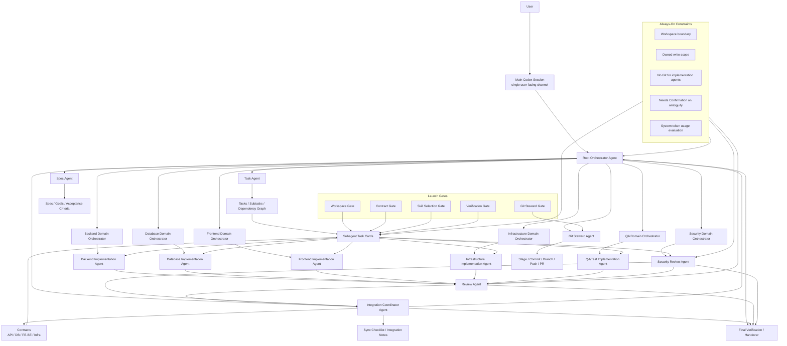

# secret_agents_v2 시스템 아키텍처

이 문서는 `secret_agents_v2`의 오케스트레이션 구조를 한눈에 보기 위한 온보딩 문서입니다.
역할의 상세 책임은 [roles.md](../agent-rules/roles.md), subagent 실행 규칙은 [subagent-execution.md](../agent-rules/subagent-execution.md), hybrid orchestration 규칙은 [hybrid-orchestration.md](../agent-rules/hybrid-orchestration.md)를 기준으로 합니다.

## 핵심 모델

`secret_agents_v2`는 사용자와 subagent 사이에서 작업 경계, dependency, contract, review, Git 흐름을 통제하는 governance control plane입니다.
메인 Codex 세션은 사용자에게 보고하는 단일 채널이고, Root Orchestrator가 전체 실행 판단을 잡습니다.

모든 역할이 별도 subagent로 생성된다고 가정하면 구조는 다음과 같습니다.

## 흐름 요약

1. 사용자는 메인 Codex 세션에 요청합니다.
2. Root Orchestrator가 workflow 모드, active workspace, domain impact, dependency graph를 정합니다.
3. Spec Agent와 Task Agent가 목표, acceptance criteria, Tasks/Subtasks를 정리합니다.
4. Integration Coordinator가 contract와 sync point를 관리합니다.
5. Domain Orchestrator는 domain-local node를 준비하고 ready node만 worker에게 넘깁니다.
6. Implementation Agent는 task card에 지정된 owned write scope 안에서만 작업합니다.
7. Review Agent와 Security Review Agent가 필요한 검토를 수행합니다.
8. Git Steward만 staging, commit, branch, push, PR 작업을 처리합니다.
9. Root Orchestrator가 검증, scope control, review 결과를 통합한 뒤 완료 또는 handover를 판단합니다.

## Task Card 중심 운영

Subagent는 스스로 workspace, write scope, Git 동작, 검증 방식을 정하지 않습니다.
Root Orchestrator나 Domain Orchestrator가 [SUBAGENT_TASK_CARD.template.md](../templates/SUBAGENT_TASK_CARD.template.md)를 채워 launch gate를 통과시켜야 합니다.

Task card에는 최소한 다음이 명시되어야 합니다.

- active workspace 또는 해당 없음
- role과 workflow mode
- mission과 acceptance criteria
- allowed write scope와 forbidden paths
- required read context
- required, suggested, excluded skills
- verification
- stop conditions
- output required

내용이 부족하면 subagent를 시작하지 말고 사용자에게 확인해야 합니다.
작업 중 누락이나 모호함이 드러나면 subagent는 추측하지 않고 `Needs Confirmation`으로 멈춥니다.

## 안정성 기준

이 구조의 목적은 많은 agent를 동시에 만드는 것이 아니라, 큰 작업을 작은 owned outcome으로 나누고 dependency가 풀린 node부터 안전하게 진행하는 것입니다.
따라서 병렬성보다 중요한 기준은 다음입니다.

- contract가 필요한 구현은 contract gate 이후에 시작합니다.
- security trigger가 있으면 Security Review Agent 경로를 먼저 확보합니다.
- 구현 agent는 Git 명령을 실행하지 않습니다.
- skill은 subagent가 역할과 작업 성격에 맞게 선택하되, scope나 권한을 넓히는 데 사용할 수 없습니다.
- System token usage가 High로 올라가면 왜 필요한지 평가하고, 다음 작업에서 줄일 수 있는 context를 기록합니다.
